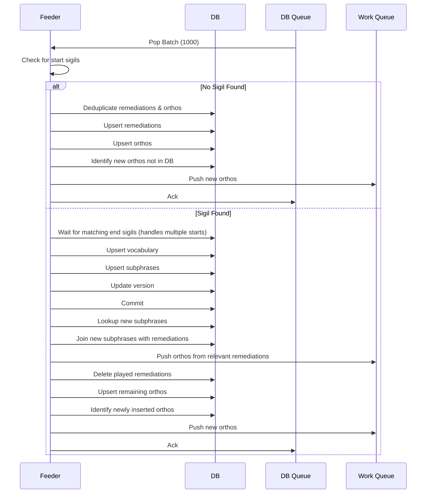

```mermaid
sequenceDiagram
    participant Feeder
    participant DB
    participant DBQueue as DB Queue
    participant WorkQueue as Work Queue

    DBQueue->>Feeder: Pop Batch (1000)

    Feeder->>Feeder: Check for start sigils
    alt No Sigil Found
        Feeder->>DB: Deduplicate  remediations & orthos
        Feeder->>DB: Upsert remediations
        Feeder->>DB: Upsert orthos
        Feeder->>DB: Identify new orthos not in DB
        Feeder->>WorkQueue: Push new orthos
        Feeder->>DBQueue: Ack
    else Sigil Found
        Feeder->>DB: Wait for matching end sigils (handles multiple starts)
        Feeder->>DB: Upsert vocabulary
        Feeder->>DB: Upsert subphrases
        Feeder->>DB: Update version
        Feeder->>DB: Commit
        Feeder->>DB: Lookup new subphrases
        Feeder->>DB: Join new subphrases with remediations
        Feeder->>WorkQueue: Push orthos from relevant remediations
        Feeder->>DB: Delete played remediations
        Feeder->>DB: Upsert remaining orthos
        Feeder->>DB: Identify newly inserted orthos
        Feeder->>WorkQueue: Push new orthos
        Feeder->>DBQueue: Ack
    end
```