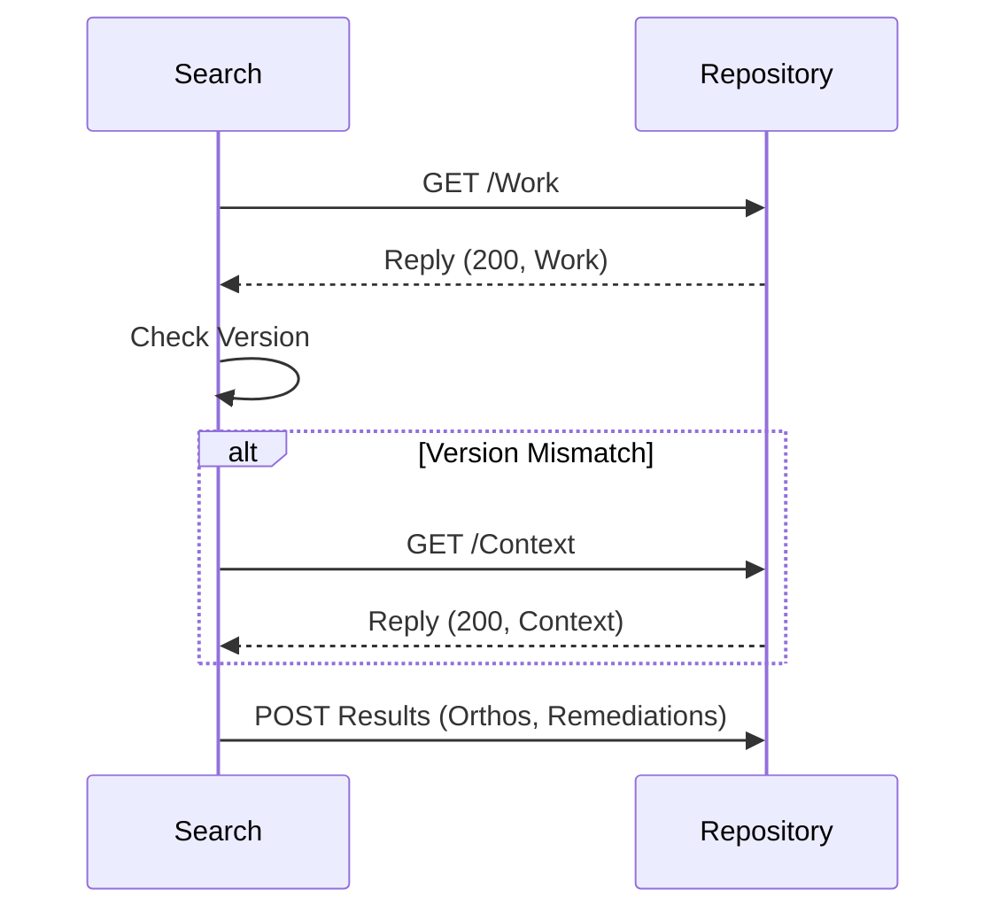

```mermaid
sequenceDiagram
    participant Search
    participant Repository

    Search->>Repository: GET /Work
    Repository-->>Search: Reply (200, Work)
    Search->>Search: Check Version
        alt Version Mismatch
            Search->>Repository: GET /Context
            Repository-->>Search: Reply (200, Context)
        end

    Search->>Repository: POST Results (Orthos, Remediations)
```