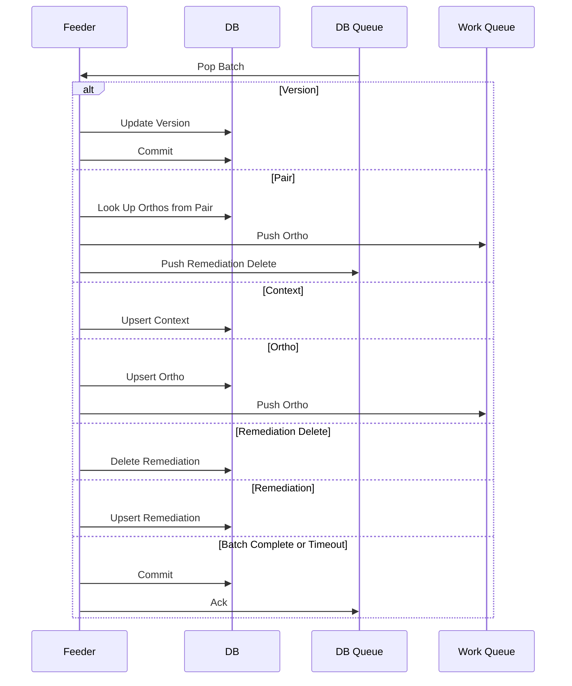

```mermaid
sequenceDiagram
    participant Feeder
    participant DB
    participant DB Queue
    participant Work Queue

    DB Queue->>Feeder: Pop Batch
    alt Version 
        Feeder->>DB: Update Version
        Feeder->>DB: Commit
    else Pair
        Feeder->>DB: Look Up Orthos from Pair 
        Feeder->>Work Queue: Push Ortho
        Feeder->>DB Queue: Push Remediation Delete
    else Context
        Feeder->>DB: Upsert Context
    else Ortho 
        Feeder->>DB: Upsert Ortho
        Feeder->> Work Queue: Push Ortho 
    else Remediation Delete
        Feeder->>DB: Delete Remediation
    else Remediation 
        Feeder->>DB: Upsert Remediation
    else Batch Complete or Timeout 
        Feeder->>DB: Commit
        Feeder->>DB Queue: Ack
    end
``` 