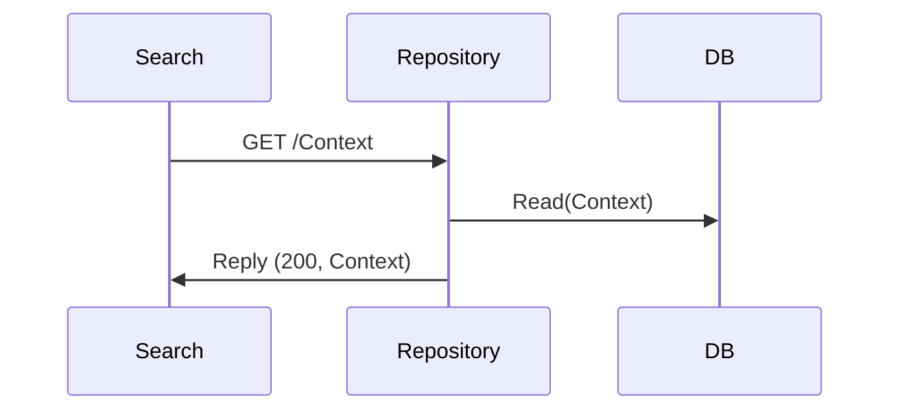

```mermaid
sequenceDiagram
    participant Search
    participant Repository
    participant DB 
    Search->>Repository: GET /Context
    Repository->>DB: Read(Context)
    Repository->>Search: Reply (200, Context) 
```