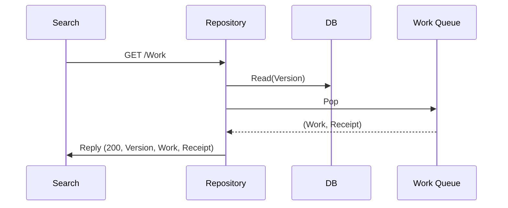

```mermaid
sequenceDiagram
    participant Search
    participant Repository
    participant DB 
    participant Work Queue
 
    Search->>Repository: GET /Work
    Repository->>DB: Read(Version)
    Repository->>Work Queue: Pop
    Work Queue-->>Repository: (Work, Receipt)
    Repository->>Search: Reply (200, Version, Work, Receipt)  
```