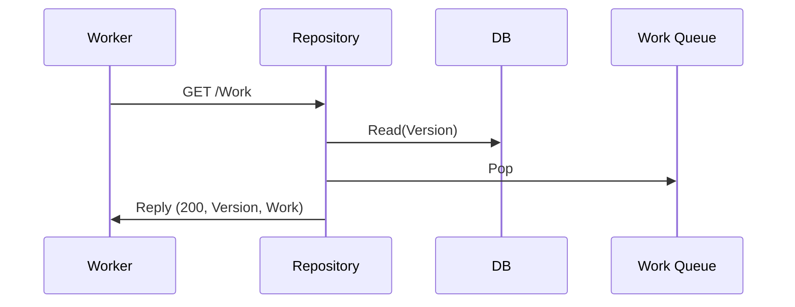

```mermaid
sequenceDiagram
    participant Worker
    participant Repository
    participant DB 
    participant Work Queue

    Worker->>Repository: GET /Work
    Repository->>DB: Read(Version)
    Repository->>Work Queue: Pop
    Repository->>Worker: Reply (200, Version, Work)  
``` 