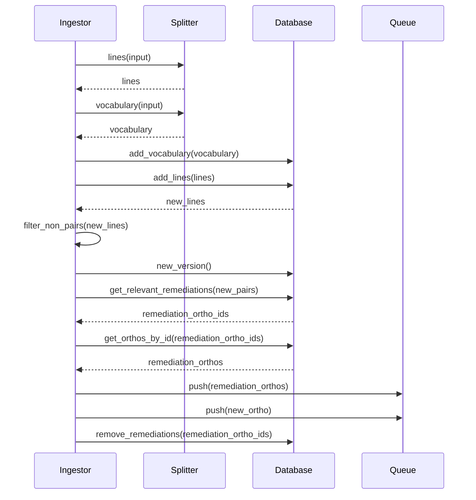

```mermaid
sequenceDiagram
    participant Ingestor
    participant Splitter
    participant Database
    participant Queue

    Ingestor->>Splitter: lines(input)
    Splitter-->>Ingestor: lines
    Ingestor->>Splitter: vocabulary(input)
    Splitter-->>Ingestor: vocabulary
    Ingestor->>Database: add_vocabulary(vocabulary)
    Ingestor->>Database: add_lines(lines)
    Database-->>Ingestor: new_lines
    Ingestor->>Ingestor: filter_non_pairs(new_lines)
    Ingestor->>Database: new_version()
    Ingestor->>Database: get_relevant_remediations(new_pairs)
    Database-->>Ingestor: remediation_ortho_ids
    Ingestor->>Database: get_orthos_by_id(remediation_ortho_ids)
    Database-->>Ingestor: remediation_orthos
    Ingestor->>Queue: push(remediation_orthos)
    Ingestor->>Queue: push(new_ortho)
    Ingestor->>Database: remove_remediations(remediation_ortho_ids)
```