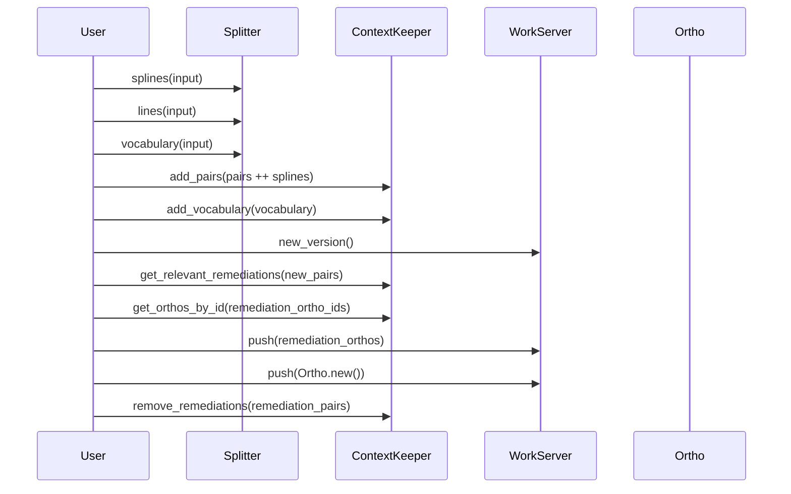

```mermaid
sequenceDiagram
    participant User
    participant Splitter
    participant ContextKeeper
    participant WorkServer
    participant Ortho

    User->>Splitter: splines(input)
    User->>Splitter: lines(input)
    User->>Splitter: vocabulary(input)
    User->>ContextKeeper: add_pairs(pairs ++ splines)
    User->>ContextKeeper: add_vocabulary(vocabulary)
    User->>WorkServer: new_version()
    User->>ContextKeeper: get_relevant_remediations(new_pairs)
    User->>ContextKeeper: get_orthos_by_id(remediation_ortho_ids)
    User->>WorkServer: push(remediation_orthos)
    User->>WorkServer: push(Ortho.new())
    User->>ContextKeeper: remove_remediations(remediation_pairs)
```