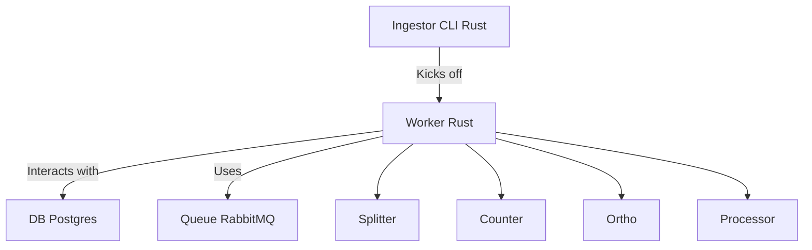

```mermaid
flowchart TD
    A[Ingestor CLI Rust] -->|Kicks off| B[Worker Rust]
    B -->|Interacts with| C[DB Postgres]
    B -->|Uses| D[Queue RabbitMQ]
    B --> E[Splitter]
    B --> F[Counter]
    B --> G[Ortho]
    B --> H[Processor]
    
    click A call linkCallback("/Users/michaelrauh/dev/crochet/src/main.rs#L0")
```