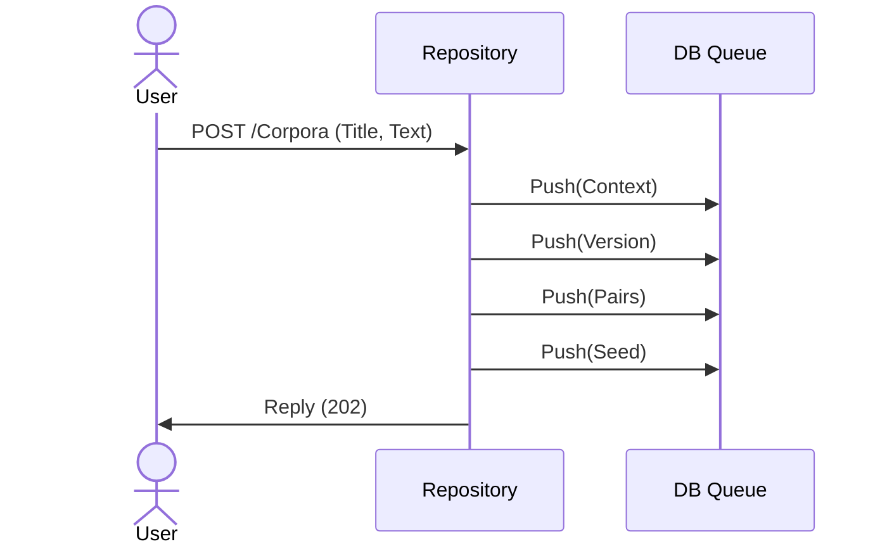

```mermaid
sequenceDiagram
    Actor User 
    participant User
    participant Repository
    participant DB Queue

    User->>Repository: POST /Corpora (Title, Text)
    Repository->>DB Queue: Push(Context)
    Repository->>DB Queue: Push(Version)
    Repository->>DB Queue: Push(Pairs)
    Repository->>DB Queue: Push(Seed)
    Repository->>User: Reply (202)  
```     