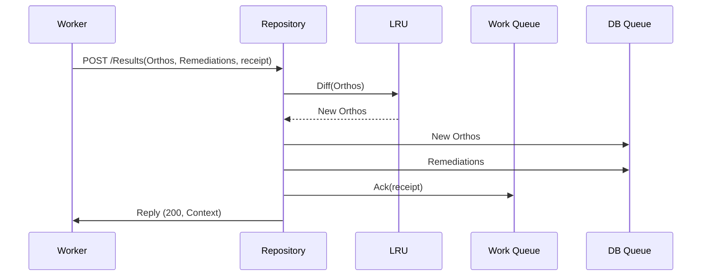

```mermaid
sequenceDiagram
    participant Worker
    participant Repository
    participant LRU 
    participant Work Queue 
    participant DB Queue

    Worker->>Repository: POST /Results(Orthos, Remediations, receipt)
    Repository->>LRU: Diff(Orthos)
    LRU-->>Repository: New Orthos
    Repository->>DB Queue: New Orthos
    Repository->>DB Queue: Remediations
    Repository->>Work Queue: Ack(receipt)
    Repository->>Worker: Reply (200, Context)    
``` 