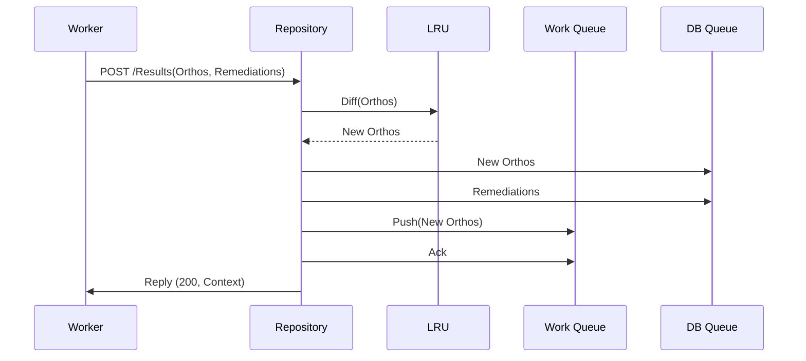

```mermaid
sequenceDiagram
    participant Worker
    participant Repository
    participant LRU 
    participant Work Queue
    participant DB Queue

    Worker->>Repository: POST /Results(Orthos, Remediations)
    Repository->>LRU: Diff(Orthos)
    LRU-->>Repository: New Orthos
    Repository->>DB Queue: New Orthos
    Repository->>DB Queue: Remediations
    Repository->>Work Queue: Push(New Orthos)
    Repository->>Work Queue: Ack
    Repository->>Worker: Reply (200, Context) 
```