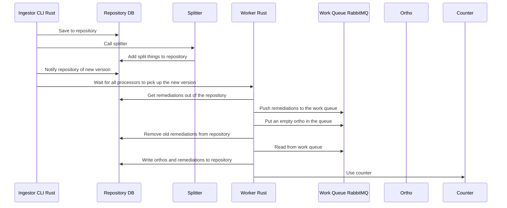

```mermaid
sequenceDiagram
    participant CLI as Ingestor CLI Rust
    participant DB as Repository DB
    participant Splitter as Splitter
    participant Worker as Worker Rust
    participant Queue as Work Queue RabbitMQ
    participant Ortho as Ortho
    participant Counter as Counter

    CLI->>DB: Save to repository
    CLI->>Splitter: Call splitter
    Splitter->>DB: Add split things to repository
    CLI->>DB: Notify repository of new version
    CLI->>Worker: Wait for all processors to pick up the new version
    Worker->>DB: Get remediations out of the repository
    Worker->>Queue: Push remediations to the work queue
    Worker->>Queue: Put an empty ortho in the queue
    Worker->>DB: Remove old remediations from repository
    Worker->>Queue: Read from work queue
    Worker->>DB: Write orthos and remediations to repository
    Worker->>Counter: Use counter
```