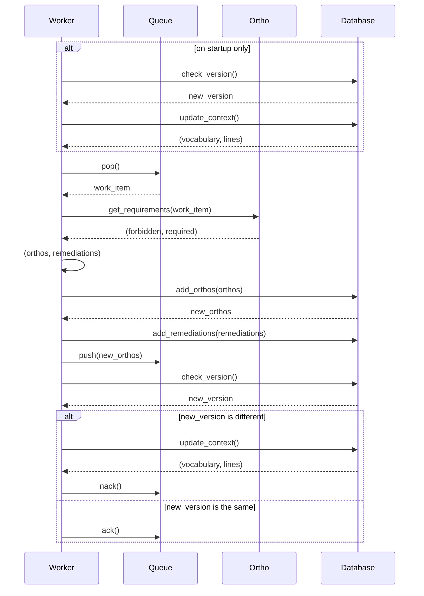

```mermaid
sequenceDiagram
    participant Worker
    participant Queue
    participant Ortho
    participant Database

    alt on startup only
        Worker->>Database: check_version()
        Database-->>Worker: new_version
        Worker->>Database: update_context()
        Database-->>Worker: (vocabulary, lines)
    end

    Worker->>Queue: pop()
    Queue-->>Worker: work_item
    Worker->>Ortho: get_requirements(work_item)
    Ortho-->>Worker: (forbidden, required)
    Worker ->> Worker: (orthos, remediations)
    Worker->>Database: add_orthos(orthos)
    Database-->>Worker: new_orthos
    Worker->>Database: add_remediations(remediations)
    Worker->>Queue: push(new_orthos)
    Worker->>Database: check_version()
    Database-->>Worker: new_version

    alt new_version is different
        Worker->>Database: update_context()
        Database-->>Worker: (vocabulary, lines)
        Worker->>Queue: nack()
    else new_version is the same
        Worker->>Queue: ack()
    end
```