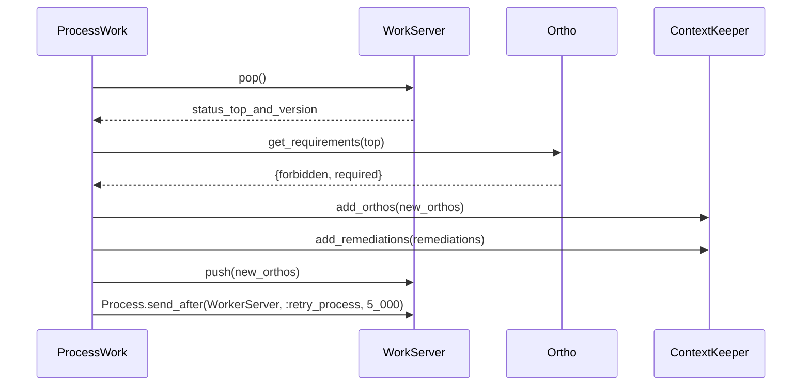

```mermaid
sequenceDiagram
    participant ProcessWork
    participant WorkServer
    participant Ortho
    participant ContextKeeper

    ProcessWork->>WorkServer: pop()
    WorkServer-->>ProcessWork: status_top_and_version
    ProcessWork->>Ortho: get_requirements(top)
    Ortho-->>ProcessWork: {forbidden, required}
    ProcessWork->>ContextKeeper: add_orthos(new_orthos)
    ProcessWork->>ContextKeeper: add_remediations(remediations)
    ProcessWork->>WorkServer: push(new_orthos)
    ProcessWork->>WorkServer: Process.send_after(WorkerServer, :retry_process, 5_000)
```