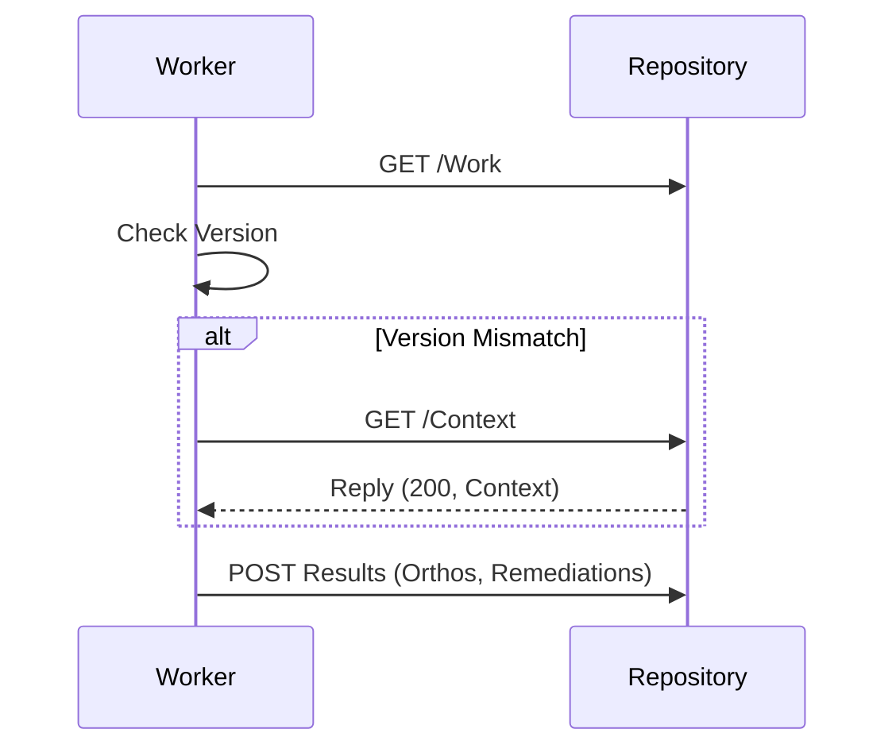

```mermaid
sequenceDiagram
    participant Worker
    participant Repository

    Worker->>Repository: GET /Work
    Worker->>Worker: Check Version
        alt Version Mismatch
            Worker->>Repository: GET /Context
            Repository-->>Worker: Reply (200, Context)
        end

    Worker->>Repository: POST Results (Orthos, Remediations) 
``` 